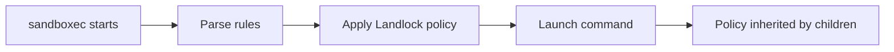

## What sandboxec Limits

sandboxec uses Linux's Landlock LSM to restrict what a sandboxed process can do. It controls:

<CardGroup cols={2}>
  <Card title="Filesystem Access" icon="folder">
    - **Read**: View file contents
    - **Write**: Modify or create files
    - **Execute**: Run binaries or scripts
  </Card>
  <Card title="Network Access" icon="network-wired">
    - **TCP Bind**: Listen on ports
    - **TCP Connect**: Initiate outbound connections
  </Card>
</CardGroup>

## Allow-List Model

sandboxec uses an **allow-list approach**: if a resource isn't explicitly allowed, it's denied.

<CodeGroup>
```bash Minimal Example
# Only /usr is accessible with read+exec rights
sandboxec --fs rx:/usr -- /usr/bin/id
```

```bash Multiple Rules
# System binaries + tmp access
sandboxec \
  --fs rx:/bin \
  --fs rx:/usr \
  --fs rw:/tmp \
  -- /bin/ls /tmp
```
</CodeGroup>

<Info>
  Rules should include every runtime dependency your command needs. Binaries often require access to `/lib`, `/usr/lib`, or shared object dependencies (`.so` files).
</Info>

## How Restrictions Are Applied

Restrictions are applied **immediately before launching** the target command:



<Accordion title="Inheritance Behavior">
  Once set, restrictions apply to:
  - The target process
  - All child processes spawned by the target
  - All descendant processes

  This ensures that the entire process tree operates under the same security constraints.
</Accordion>

## Security Guarantees

<Check>**What it protects against:**</Check>

- Buggy or malicious user-space programs accessing unauthorized files
- Untrusted scripts reading sensitive data (e.g., `~/.ssh`, `~/.aws`)
- Third-party CLIs making unexpected network connections
- Generated code writing to critical system paths

<Tabs>
  <Tab title="Example: Prevent Data Exfiltration">
    ```bash
    # Lock command to local filesystem only
    sandboxec \
      --fs rx:/usr \
      --fs rw:$PWD \
      -- ./untrusted-script.sh
    # No network access = no data exfiltration
    ```
  </Tab>
  <Tab title="Example: Restrict Network">
    ```bash
    # Allow HTTPS only (connect on 443)
    sandboxec \
      --fs rx:/usr \
      --net c:443 \
      -- /usr/bin/curl https://example.com
    # Cannot connect to other ports
    ```
  </Tab>
  <Tab title="Example: Read-Only Workspace">
    ```bash
    # Give read-only access to workspace
    sandboxec \
      --fs rx:/usr \
      --fs r:$PWD \
      --fs rw:/tmp \
      -- ./analyzer tool
    # Cannot modify source files
    ```
  </Tab>
</Tabs>

## Limitations

<Warning>
  **sandboxec does NOT protect against:**
  
  - **Kernel bugs or exploits**: Landlock operates at the kernel level. If an attacker can exploit a kernel vulnerability, they can bypass restrictions.
  
  - **Privileged local attackers**: Users with root or CAP_SYS_ADMIN can override Landlock policies.
  
  - **Resource exhaustion**: sandboxec does not limit CPU, memory, disk usage, or I/O. A sandboxed process can still consume all available resources.
  
  - **Every host interaction**: Only filesystem and TCP are controlled. Other interfaces (e.g., Unix sockets, shared memory, signals) are not restricted by Landlock.
  
  Treat sandboxec as a **practical containment layer**, not a complete security boundary.
</Warning>

## When to Use Containers or VMs Instead

Use containers or VMs when you need:

- **Stronger isolation boundaries** than process-level sandboxing
- **Multi-tenant isolation** between untrusted users or workloads
- **Resource isolation/quotas** (CPU, memory, disk, I/O limits)
- **Custom root filesystems** or full OS-level virtualization
- **Complete network isolation** (not just TCP port filtering)

<Info>
  sandboxec is designed for **quick command-level isolation** with low overhead. For complex workloads requiring comprehensive isolation, use containers (Docker, Podman) or VMs.
</Info>

## Practical Use Cases

<CardGroup cols={2}>
  <Card title="Third-Party CLIs" icon="terminal">
    Run tools against local repos without full host access
    ```bash
    sandboxec --fs rx:/usr --fs rw:$PWD -- third-party-cli
    ```
  </Card>
  
  <Card title="Generated Code" icon="code">
    Execute AI-generated scripts in CI with restricted access
    ```bash
    sandboxec --fs rx:/usr --fs rw:/tmp -- ./generated.sh
    ```
  </Card>
  
  <Card title="Install Scripts" icon="download">
    Test install scripts before trusting them
    ```bash
    sandboxec --fs rx:/usr --fs rw:/tmp --net c:443 -- curl -sSL url | sh
    ```
  </Card>
  
  <Card title="Build Tools" icon="hammer">
    Wrap build tools that only need specific paths
    ```bash
    sandboxec --fs rx:/usr --fs rw:$PWD --net c:443 -- npm install
    ```
  </Card>
</CardGroup>

## Design Philosophy

sandboxec focuses on reducing the **blast radius** of risky commands:

- **No daemon**: No background service to manage
- **No root**: Runs as regular user with Landlock
- **No image build**: Direct command sandboxing, no container layers
- **Explicit rules**: Clear allow-list for every resource

<Note>
  The goal is to make command-level sandboxing as lightweight as running the command itself, while providing meaningful protection against common threats.
</Note>
